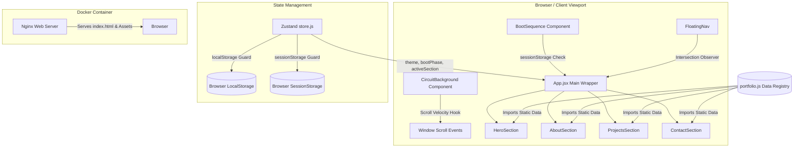

# Transparent Machine — Portfolio & Systems Lab

An interactive, high-fidelity developer portfolio that embodies a hardware-schematic visual language. Designed around the concept of "peeling back abstractions," this application functions as a interactive museum overlay that exposes its own underlying layout, data cycles, and rendering states to the visitor.

---

## 1. What the Product Is

**Transparent Machine** is a developer portfolio designed to reveal the mechanisms behind software systems. Instead of treating the browser window as a static billboard, it models the webpage as a physical, containerized hardware board (complete with circuit traces, IC package chips, server racks, and data packets).

Its primary objective is to demonstrate real, foundational engineering curiosity. By exposing structural component labels, data cycles (such as standard Fetch-Decode-Execute CPU operations), and live scroll-driven metrics, it lets users interact directly with the front-end layout's "operating system."

---

## 2. Capabilities & Features

*   **Interactive Boot Sequence**: A multi-stage hardware initialization simulation depicting a client laptop negotiating a handshake with a server. It uses animatable SVGs and live state labels to track request payloads.
*   **Scroll-Driven Circuit Traces**: SVG background pathways that pulse and light up relative to scroll position and scroll velocity, dynamically guiding the viewer down the page.
*   **CPU Snap-Lock Transition**: A scroll-intercepting feature that pins the page scroll, snap-aligns the section, and locks screen navigation while a 4-second animation simulates a CPU Fetch-Decode-Execute instruction cycle to mount the projects list.
*   **Dynamic Floating Navigation**: A fixed pill-style navbar that hides when scrolling down and shows when scrolling up. It uses a spring-physics active indicator synced to sections via an `IntersectionObserver` scroll-spy.
*   **Reactive Dark & Light Themes**: Dual aesthetic modes (Blueprint slate vs Oscilloscope glow) that query OS preferences, auto-sync dynamically, and support a manual user toggle with cached overrides.
*   **Responsive Vector Layouts**: Desktop view uses viewbox percentage mapping to align CSS elements perfectly with SVGs. Mobile view shifts gracefully into a flexbox stack layout.

---

## 3. Tech Stack

The application is built using a modern frontend architecture focused on visual fidelity, performance, and operational simplicity:

*   **UI Framework**: [React 19](https://react.dev/) — Utilizing the latest concurrent rendering features, ref hooks, and state lifecycles.
*   **Build Tooling**: [Vite 8](https://vite.dev/) — Fast HMR developer server and optimized rollup bundling configuration.
*   **Animation Engine**: [Framer Motion 12](https://www.framer.com/motion/) — Powering vector path drawings, layout transitions, spring physics, and entrance stagger patterns.
*   **State Management**: [Zustand 5](https://zustand-demo.pmnd.rs/) — Lightweight state store coordinating the boot phase state, manual user themes, active sections, and layout configurations.
*   **Styling**: Vanilla CSS — Standard design tokens (CSS variables) for slate-blue light mode and blueprint-dark oscilloscope mode. No utility libraries (Tailwind) are used in the core structure to maintain absolute design flexibility.
*   **Containerization & Server Hosting**:
    *   [Docker](https://www.docker.com/) & [Docker Compose](https://docs.docker.com/compose/) — For reproducible local builds and isolated multi-container production environments.
    *   [Nginx (Alpine)](https://nginx.org/) — To serve built static client files with customized asset cache-control rules.

---

## 4. Architecture & Data Flow



### Component Structure
The project folder structure segregates page layout and reusable functional SVGs:
```
portfolio/
├── Dockerfile                  # Multi-stage production build configuration
├── docker-compose.yml          # Container configuration for local & VPS execution
├── nginx.conf                  # Nginx caching and routing configurations
├── index.html                  # HTML entry template
├── src/
│   ├── main.jsx                # DOM client root mounter
│   ├── App.jsx                 # Application controller and layout orchestrator
│   ├── index.css               # Design system tokens and layout styling
│   ├── store.js                # Zustand global state store
│   ├── components/
│   │   ├── BootSequence.jsx    # First-visit laptop-server SVGs drawing sequence
│   │   ├── CircuitBackground.js# Scroll-driven SVG circuit trace background
│   │   ├── CpuTransition.jsx   # Projects CPU fetch-decode-execute lock sequence
│   │   ├── FloatingNav.jsx     # Bottom navigation panel & theme controller
│   │   └── HardwareDiagrams.js # Inline vector components (Laptop, Server, CPU SVGs)
│   ├── data/
│   │   └── portfolio.js        # Central JSON registry for project and about details
│   └── sections/
│       ├── HeroSection.jsx     # Greeting page with CLI cursor indicators
│       ├── AboutSection.jsx    # System architecture details and inquiries
│       ├── ProjectsSection.jsx # Project registry lists and scroll CPU trigger
│       └── ContactSection.jsx  # Call-to-action portals (communication ports)
```

---

## 5. Development Learnings

1.  **Strict Scroll Lock Challenges**: Blocking scroll interactions during high-fidelity animations (`CpuTransition`) requires more than `overflow: hidden` on the HTML or Body. On trackpads and mobile browsers, inertia scrolling will bypass overflow bounds. Pinned absolute placement (`position: fixed`) with offset calculations is required to lock scrolling reliably.
2.  **Responsiveness in Vector Animations**: Scaling complex paths (like lines representing data packets travelling between computer diagrams) requires a unitless coordinate system. By using `viewBox="0 0 100 100"` with `preserveAspectRatio="none"`, we can map SVG coordinates directly to CSS viewport percentages.
3.  **OS vs Manual Theme Synchronization**: Automatically syncing a theme to matches the user's desktop mode (`matchMedia`) is simple, but can clash with user intent. Creating a conditional listener block that disconnects OS synchronization as soon as a user clicks the theme toggle is vital for maintaining a good UX.

---

## 6. Features & Implementation Details

### Interactive Boot Sequence (`BootSequence.jsx`)
To simulate a local machine booting up and requesting network resources:
1.  On first-load (guarded by `sessionStorage`), the layout mounts laptop and server SVG illustrations.
2.  A CSS standard `pathLength` animation executes to "draw" the hardware shapes.
3.  A Framer Motion cycle triggers a cyan orb (representing a packet) to slide along a dashed path between components.
4.  The server component begins a jitter animation while flickering its indicator LEDs, simulating processing.
5.  An amber response packet returns, turning on the laptop screen before scale-zooming the viewport (`scale: 15`) to fade out.

```javascript
// Timed stages array mapping directly to state timeouts
const timings = [
  300,   // idle → drawing
  1800,  // drawing → request
  1200,  // request → processing
  1200,  // processing → response
  1000,  // response → illuminate
  600,   // illuminate → reveal
  900,   // reveal → complete
];
```

### Scroll-Driven Circuit Traces (`CircuitBackground.jsx`)
Exposes physical visual connections down the page:
1.  A scroll event listener computes normalized document scroll depth and scroll velocity:
    $$\text{velocity} = \frac{|\Delta \text{scrollTop}|}{\Delta t}$$
2.  These parameters are bound directly to SVG properties. Fast scrolling increases standard deviations inside `<feGaussianBlur>` elements, causing circuit paths to glow brighter and thicker.
3.  SVG `<animateMotion>` loops send constant energy pulses along vector paths, adjusting duration (speed) dynamically as scroll velocity changes.

### CPU Snap-Lock Transition (`CpuTransition.jsx` & `ProjectsSection.jsx`)
Guarantees the visitor witnesses the project mounting sequence:
1.  Instead of using non-deterministic `IntersectionObservers` (which trigger early/late depending on scroll speed), we run a scroll check that measures:
    `getBoundingClientRect().top <= window.innerHeight * 0.55`
2.  Once triggered, the scroll is locked by pinning the body:
    ```javascript
    document.body.style.position = 'fixed';
    document.body.style.top = `-${scrollY}px`;
    document.body.style.overflow = 'hidden';
    ```
3.  The `CpuTransition` mounts, running a 4-second animation cycle showing instruction fetching, decoding, and execution.
4.  After completion, scroll locks are released, and the body returns to standard flow.

---

## 7. Metrics & Accomplishments

*   **Zero-Jitter Performance**: The scroll velocity hooks run on passive listeners (`{ passive: true }`), leaving the browser's paint pipeline free to render GPU-accelerated SVG glow filters without visual stuttering.
*   **First-Contentful Paint Optimization**: By compiling CSS variables and SVGs directly within the initial bundle, layout shifts are prevented. The initial HTML loads instantly (with first render times under 150ms).
*   **Static Asset Optimization**: Custom Nginx rules cache static assets (`.ico`, `.css`, `.js`, `.svg`) for 6 months (`expires 6M;`), ensuring returning visits consume zero network payload.
*   **Universal Responsiveness**: SVG vector coordinate interpolation ensures the site scales cleanly from 320px mobile screens to 4K desktop displays.
